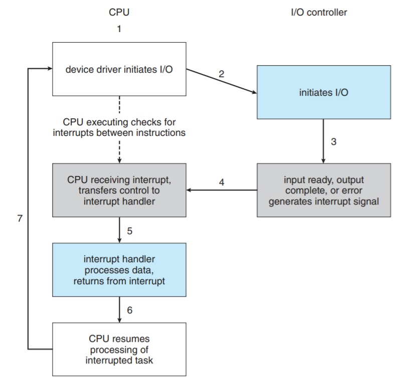
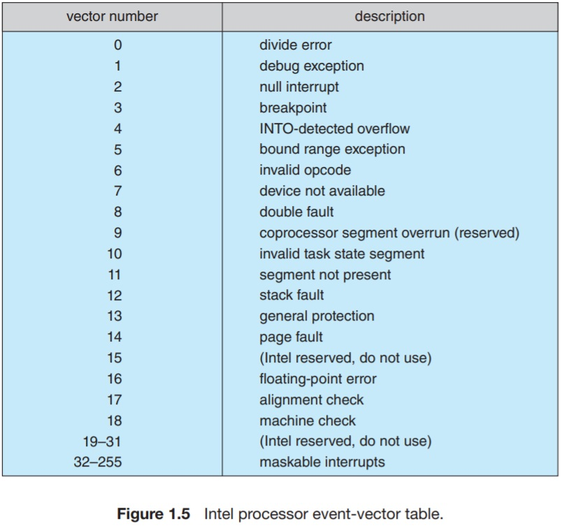

# 1.2.1 Interrupts
Starting with a typical operation of a computer, a program performing I/O. At the very high level, the user specifies an I/O operation in their program which may be a _read character from keyboard_ operation. When the program runs, it will ask the device driver to carry out this operation. The device driver, in turn, will load the special-purpose registers in the controller with the appropriate values. The device controller examines those values and determine the action to take (in this case, read a character from keyboard). The controller starts to transfer data from the device to its local storage buffer. Once the transfer is complete, now the driver can take the value from the local storage buffer. 

Now, the device controller _informs_ the driver that it has finished the operation. The device driver then gives control to a part of the operating system possible returning the data or a pointer to the data (if the operation was _read_). For other operations, the OS might return the status information of the operation such as "completed successfully" or "device is busy". 

The controller informs the driver that it has finished its operation via an _interrupt_.

## 1.2.1.1 Overview
Hardware triggeres an interrupt at any time by sending a signal to the CPU. This is done usually by way to the system bus. 

When a CPU is interrupted, it stops what it is doing and immediately transfers execution to a fixed location. This fixed location usually contains the starting address where the service routine for the interrupt is located. On completion of the interrupt service routine, the CU resumes the interrupted computation.

Each computer design has its own interrupt and mechanism. Several functions are common so they're typically implemented in all commercial designs. The interrupt transfers control to the appropriate ISR. This is done by maintaining a table of pointers to ISRs in memory. This array is typically stored in low memory addresses. This table provides indirect addressing to a specific ISR. 

This array or _interrupt vector_ is inedxed with a unique number that identifies the request.  

The interrupt architecture must also save the state information of whatever was interrupted, so that it can restore this information after servicing the interrupt. Any modifications in the processor state that an ISR might make (such as changing the values of a register), it has to first save the processor's initial state so as to restore it when the interruput finishes. After serving an interrupt, the saved return address is loaded into the program counter and the interrupted computation resumes as though the interrupt had not occurred.

## 1.2.1.2 Implementation
The basic interrupt mechanism works as follows. 

The CPU has a wire(pin) called interrupt-request line. The CPU senses this pin after the execution of every instruction. If the CPU detects that a controller has _asserted_ a sgnal on the interruput request line, it reads the interrupt number and jumps to the ISR. This is done by indexing the interrput vector table.

At the ISR, the interrupt saves any state it will be altering during its operation, determines the cause of the interrupt, peforms the necessary processing, restores the CPU state to the saved state, and finally executes an instruction that _returns from interrupt_. 

This is the basic interrupt mechanism, however, we need more sophisticated interrupt-handling features.

* We need the ability to differ the interrupt handling during critical processing. 
* We need an efficient way to dispatch to the proper interrupt handler for a device.
* We need multilevel interrupts, so that the operating system can distinguish between high- and low-priority interrupts and can respond with the appropriate degree of urgency.

Most CPUs have two interrupt request lines. One is the _nonmaskable interrupt_, which is reserved for events such as unrecoverable memory errors. The second line is _maskable_. It can be turned off bu the CPU before the execution of a critical instruction sequence that must not be interrupted. The maskable line is used by device controllers to request service.

The purpose of the vectored interrupt mechanism eliminates the usage of one generic interrupt handler that issues the specific wanted interrupt. 
In practice, the system requires a big number of interruputs so that the table might hog a huge pile of memory. A common way to solve this problem is to use _interrupt chaining_, in which a small number of categories of interrupts that are saved in the vector table. Each of those contain a pointer to a list of interrupts of the same category. When an interrupt is raised, the handles on the corresponding category or list are called one by one, until one is found that can service the request. 

This strategy represents a tradeoff between memory space and performance overhead of multiple calls before the interrupt dispatch.

Figure 1.5 illustrates the design of the interrupt vector for Intel processors.

The events from 0 to 31 are nonrecoverable, and, hence, unmaskable.
The events from 32 to 255 are maskable and are used for purposes such as device interrupts.

The interrupt mechanism aslo implements a system of _interrupt priority levels_. These levels enable CPU to defer the handling of a low-priority interrupt and makes it possible for a high-priority interrupt to preempt the execution of a low priority interrupt. This also enables not issuing a low-priority interrupt if the processor is through a critical portion of instructions without masking all interrupts.

## Summary of interrupts: 
They are used throughout modern operating systems to handle asynchronous events. Device controllers and hardware faults raise interrupts. To enable the most urgent work to be done first, modern computers use a system of a priority levels. Interrupts are highly frequent because they're issued for a huge number of reasons, and with that said, it is required for having a good performance to handle interrupts efficiently. 