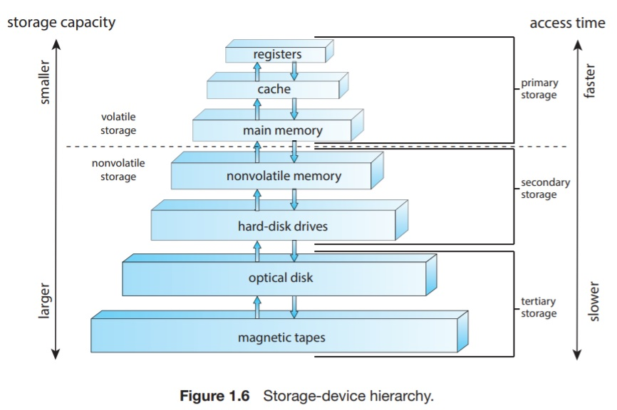

# Storage Structures
The CPU can load instructions only from memory. This means that every program must be loaded into memory to run. Most programs are run from a rewritable memory called main memory. Main memory is commonly implemented in **DRAM** semiconductor technology.

The first program that runs on a computer when power is turned on ia a _bootstrap program_. This program is responsible for loading the OS. RAM is volatile and cannot be trusted to store the bootstrap program. Therefore, computers use an EEPROM chip to store the bootstrap program and other forms of firmware.

the EEPROM chip's content can be changed but not frequently. In addition, it is low speed. It contains mostly static programs and data that are not frequently used. 

IPone uses EEPROM to store serial numbers and hardware information about the device.

### **Instruction Cycle**
On a von Neumann architecture, a typical instruction cycle goes as follows.
First, the processor fetches the instruction from memory and stores that instruction in the _instruction register_. The instruction is then _decoded_ and may need operands to be fetched from memory and stored in some internal register. Afterwards, the instruction is executed. After that the result may be stored in back in memory. 

The memory is agnostic to the source of the address. It does not care whether it came from instruction counter, indexing, indirection, or some other means. 

Accordingly, we can ignore _how_ memory address is generated by a program. The memory is only interested in the sequence of addresses generated by the program.

Ideally, we want the programs and data to reside in main memory permanently. This arrangement is not feasible for the following to reasons.
* Main memory is usually too small to store all the needed programs and data permanently.
* Main memory is implemented using a volatile technology. Which means it loses contents when power is turned off.

### **Other Storage Means**
For the mentioned reasons, most computer systems provide _secondary storage_ as an extension of main memory. The main requirement for secondary storage is that it be able to hold large quantities of data permanently.

The most common secondary storage means are _HDDs_ and _NVM devices_. Those provide storage for both programs and data. 

Most programs are stored in secondary storage and only loaded to main memory when needed.

Many programs use secondary storage as both the source and the destination of processing. 

Secondary Storage is much slower than main memory. Hence, the porper management of secondary storage is crucial and of central importance to a computer system.

The discussed storage means are the most common in computer systems. This does not mean that they're the only ones. Other possible components include CD-ROM, magnetic tapes, and so on. Those are slow enough and large enough that they are used only for special purposes (usually in backing up.) and are called _tertiary storage_. Each and every storage component provides at least the functions of storing ad datum and holding that datum until it is retrieved at a later time.

The main differences between storage systems are speed, size, and volatility. Figure 1.6 shows a hierarchy according to capacity and access time.

As a general rule, there is a trade-off between size and speed. With smaller memories having smaller access time. 

Small storage components are used close to the CPU. 

### **Nomenclature throughout the book**
Volatile memory will be referred to simple as _memory_. Any variants will be specified explicitly.

Nonvolatile storage will be referred to as NVS and will be classified into two types.

* **Mechanical** such as HDDs and optical disks.
* **Electrical** such as Flash memory, FRAM, NRAM and SSD. (will be referred to as __NVM__.

Mechanical storage is generally larger, less expensive per byte, and slower than electrical storage.
