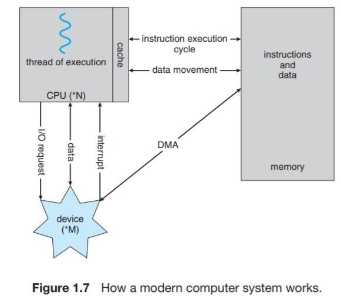

# I/O Structure
A large portion of the operating system code is dedicated to managing I/O. Both because of its importance to the reliability and performance of a system and because of the varying nature of devices.

As discussed, computing systems consist of multiple devices, all of which exchange data via a common bus. The interrupt-driven IO is fine for moving small amounts of data but can produce a significant overhead when used for bulk data movement such as NVS IO.

To solve this problem, a technique called _direct memory access(DMA)_ is used. 
After setting up the device controller to inform it with the request, the device controller transfers an entire block of data directly to the main memory without the intervention of the CPU. Only one interrupt is generated per block to tell the device driver that the operation is complete. While the device controller is performing these operations, the CPU is available to accomplish other work.

This greatly improves throughput because, in the case of interrupt-driven IO, the CPU is essentially stalled from what it was doing. It would be wasting a lot of CPU cycles if it waited for the block to be fetched.

