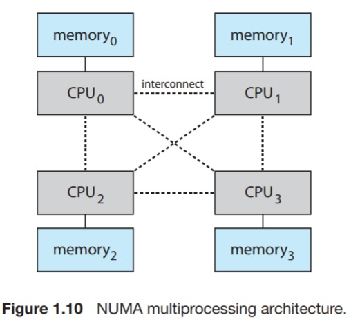

# Computer System Organization
A computer system can be organized in a number of ways, which we can categorize them roughly according to the number of general-purpose processors used.

## 1.3.1 Single processor Systems
In this organization, only one processing _core_ is used. 
The one main core is capable of executing a general-purpose instruction set. 
It can execute instructions from processes.

These systems typically have special-purpose processors. They may come in the form of device-specific processors, such as disk, keyboard, and graphics controllers. 

These special-purpose processors only run a limited instruction set and they do not run instructions from processes. Sometimes, they're managed by the OS in the sense that the OS issues a request to some special-purpose processor and monitor its status. 

For example, a disk controller microprocessor receives a sequence of requests from the main CPU. This controller is responsible for implementing its queueing and scheduling algorithms. 

Another organization is that the OS cannot communicate with those special-purpose processors as they're built on a very low level in the hardware. In that sense, those processors run autonomously. 

The use of special-purpose processors does not turn a single-processor system into a multi-processor one.

## 1.3.2 Multiprocessor Systems
Multiprocessor systems dominate the landscape of computing nowadays.

Such systems have two or more processors, each with a single-core CPU. Processors share the computer bus and sometimes the clock, memory, and peripherals.

the primary advantage of multiprocessor systems is the increased throughput. However, this does not scale exactly (i.e., with N processors, we do not get N times the performance because of the overhead of keeping all the components working correctly and contention for shared resources)

The most common architecture of those systems is the symmetric multiprocessing (SMP), in which each processor performs all tasks, including the OS functions and user processes. 

Each processor has its own set of registers and local cache. However, they share some resources such as L2 cache and main memory.

With this organization, we can run N processes simultaneously without a huge overhead.

_Multicore_ systems are ones with multiple computing cores on a single chip.
This can be more efficient than multiple chips with single cores. This is mainly because on-chip communication is much faster than inter-chip communication.
Also, power consumption for a single chip can be less than that of multiple chips.

Multicore processor with N cores appears to the OS as N standard CPUs. This puts pressure on the OS designers and application programmers to make efficient use of those CPUs.

The throughput does not scale well with multiple cores because bus bandwidth becomes bottlenecked and contention for shared resources degrade performance greatly. 

One solution to this problem is to provide each CPU (or a group of CPUs) with its own local memory that is accessed via a small and fast local bus.

Those CPUs, have to be interconnected so that all CPUs share the same physical address space.

This is known as non-uniform memory access (_NUMA_) and is illustrated in figure 1.10

The advantage of NUMA systems is that when a CPU accesses its local memory, not only it is fast, but there is also no contention over the system bus.

NUMA systems can scale more effectively as more processors are added.

A potential drawback of NUMA systems is that when a CPU needs to access a remote memory address, this would degrade the performance.

This is, largely, the job of the OS to minimize this penalty be carefully managing memory and scheduling accesses.

## 1.3.3 Clustered Systems
Clustered systems gather together multiple CPUs. They're different from multiprocessors in that they are composed of multiple individual systems joined together. Typically, each system is a multicore system in itself.

The generally accepted definition of _clustered computers_ is that they share storage and are closely linked by a local-area network LAN or a faster interconnect like _InfiniBand_.

Clustering is used to provide _high-availability sercive_. Service will continue even if one or more systems in the cluster fail.

_High-availability service_ can be achieved by adding a level of redundancy in the system. 
By adding a software layer to the cluster nodes where each node can monitor one or more of the other nodes (over the network). If the monitored node fails, the monitoring node can take over its storage and restart the application that were running on the failed machine.

By using this mechanism, the service will be correctly delivered to the user, they will only experience a brief interruption of service.

High availability also provide increased reliability, which is crucial in many applications. 

The ability to provide service proportional to the level of surviving hardware is called _graceful degradation_.

Some systems provide _fault tolerance_ which means that they can suffer a failure in any single component and still continue operation. Fault tolerance requires failure detection, diagnosis, and, if possible, correction.

### Symmetry of clustered systems
* Asymmetric clustering: one machine is hot-standby while all others are running the applications. The hot-standby machine does nothing but monitor the active server. If the monitored active server fails, the hot-standby host becomes the active server.

* Symmetric clustering: Two or more hosts are running applications and are monitoring each other. This is more efficient but is more complex and requires that more than one application be available to run.

Clusters can provide a high-performance computing environment because they're connected via a network.

Such systems can supply significantly greater computational power than single-processor or SMP systems because clusters consist of multiple SMP systems that can run applications concurrently on all the systems. 

**The application must have been written to adapt to this concurrent environment.**

This paradigm involves a technique called _parallelization_. This essentially means that the computation is divided into sub-pieces, each of which runs on a separate computer, and the partial results get combined at the end to form the final result.

Clusters can also be connected over a wide-area network (WAN). 

Parallel clusters allow multiple hosts to access the same data on shared storage.

### Storage Area Networks (SANs)
It allows many systems to attach to a pool of storage. If the applications and data are stored on the SAN, then the cluster software layer can assign any of the hosts attached to the SAN to it. 
If this host fails, then any other host can be assigned to it.
This is mostly important for database clusters because dozens of hosts share the same database, greatly improving the performance and reliability.

