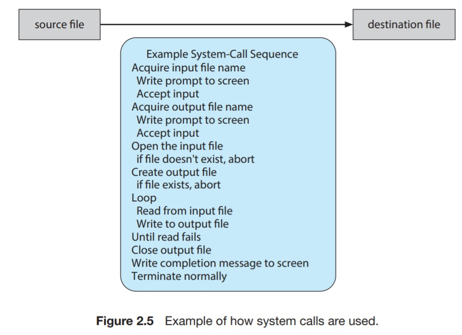
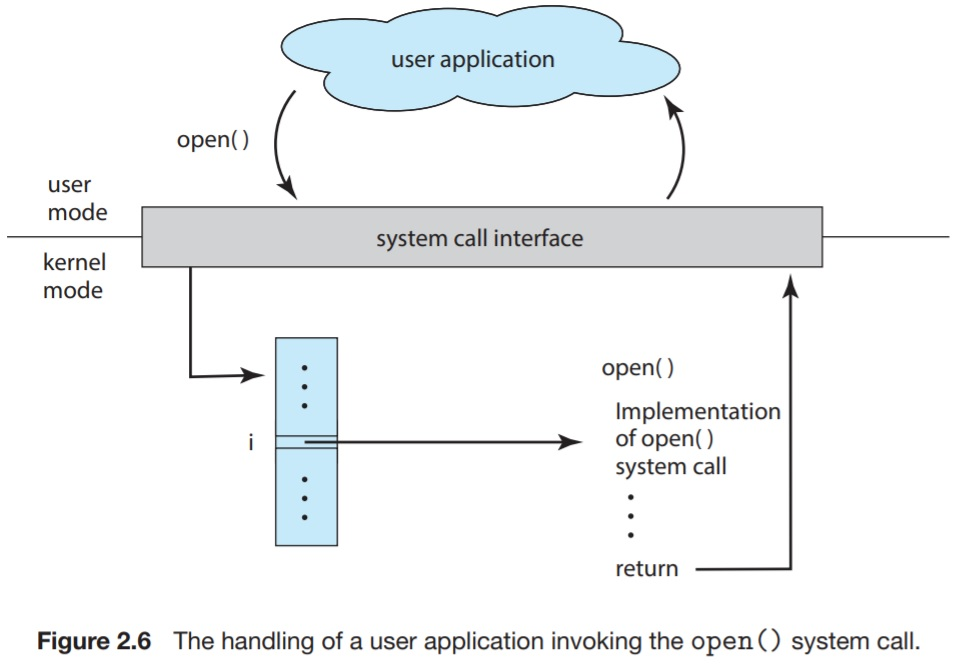

# 2.3 System Calls
System calls provide an interface for services provided by the OS. 
> Example: copying the contents of a file into a new file. 

Figure 2.5, illustrates how system calls are used and how often they might be used.

Such a complicated sequence of system calls are called for a relatively simple task as a file copy operation. 

## 2.3.2 Application Programming Interface
Frequently, OSs execute thousands of system calls per second. Application developers usually design programs according to an _API_. The API specifies a set of interface functions that are available to the application developer.

The interface functions provided in the API invoke the actual system calls on behalf of the application programmer.

> Example: In windows, the API function `CreateProcess()` invokes the windows system call `NTCreateProcess()`.

It is convenient to use an API and not to directly use the system calls for the following reasons. 

* Portability. Using APIs could pertain to other systems implementing the same API even if the internal system call is different (This has to be handled by the API itself.)
* Ease. API interface functions may abstract a lot of the thorny details of the system call for the convenience of the user.
* APIs can be defined to be similar to different APIs so that it is easier to deal with the OS coming from another one. While the internals of the two OSs might be irreconcilable.
* Making the system call directly in the application code is more complicated and may require embedded assembly code to be used (in C and C++) as well as knowledge of the low-level binary interface for the system call operation. 

Run-time environment(RTE) is an important factor in handling system calls.
> RTE: The full suite needed to execute an application written in a given programming language, including its compiler or interpreter, as well as other software such as libraries and loaders.

It provides a _system call interface_ that serves as the link to system calls available by the OS.

The system call interface _intercepts_ the function calls made in the API and invokes system calls.

A number is associated with each system call. The system call interface maintains a table to be indexed with the system call number to jump to the serve the specified request.

The caller must only obey the API interface and understand _what_ will happen as a result of the request.

Thus, API and RTE hide all the unnecessary details from the user.

When a User Mode process invokes a system call, the CPU switches to Kernel Mode and starts the execution of a kernel function called the System Call Handler. This System Call Handler has a similar structure to that of other "Exception Handlers".

Issuing a system call can be done in several ways depending on the computer in use. Often, there is information that must be supplied to the system call interface other than the system call number.

This information, if sufficiently small, can be stored in registers. In case the parameters to the system call are quite large, they can be stored in a block in memory, and the beginning address of this block is passed in a register.
Linux uses a combination of these, if there are five or fewer, they're passed in registers. If there are more than 5 parameters, they're put in memory.

Another method is to push the parameters on the stack by the program and to pop them off the stack in the operating system.
