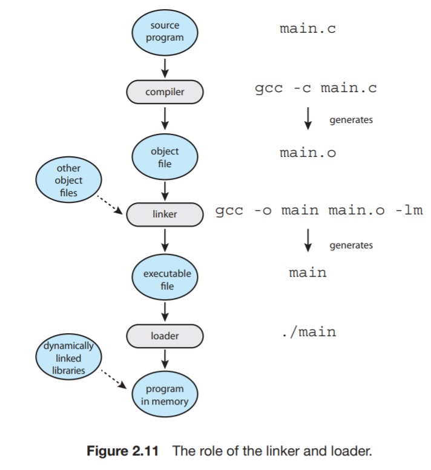

# 2.5 Linkers and Loaders
A program resides on the disk as a binary executable format. _prog.exe_, for example. To run on a CPU, it must be _loaded_ into memory in the context of a running process. This is depicted in figure 2.11

Source files are compiled into _relocatable object files_, which do not contain addressing information regarding where this might reside in memory.

Relocatable object files are input to the linker, of which job is to coalesce all the relocatable files into an _executable object file_, and fill the missing addressing information.

A loader loads the binary executable into memory, where it can run on the CPU. 

This is done by `fork()`ing a new process, and `exec()`ing the executable file in its context.

Windows provides dynamic linking, which conditionally links parts of code only as needed, resulting in a light-weight executable, potentially.

Object files typically have standard formats. For Linux, it's called ELF (_executable and Linkable Format_). 

There are separate ELF formats for relocatable files and executable files.