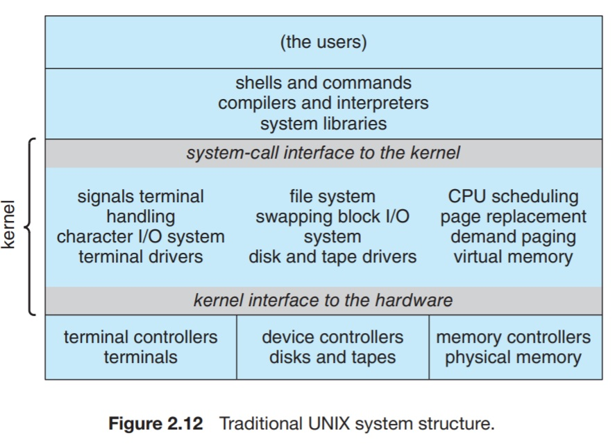
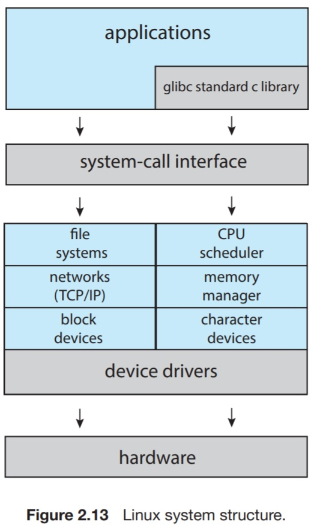
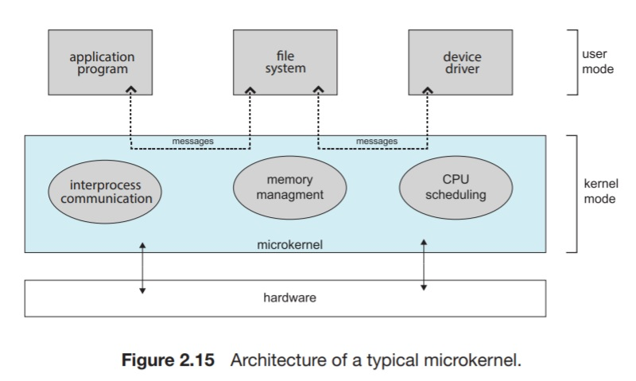

# 2.8 Operating System Structure

A common division scheme of a piece of software is to partition the program into small components. Each module should be a well-defined portion, with a carefully-defined interface.

## 2.8.1 Monolithic Structure

Placing all the functionality of the kernel into a single, static binary file that runs in a single address space is known as a _monolithic structure_.

> Original UNIX OS, which consists of two separable parts: the kernel and the system programs. The kernel is separated into a series of interfaces and device drivers. (represents a kernel of such monolithic structure).

The Linux OS, based on UNIX, is structured similarly. The general organization of Linux is in figure 2.13

As shown in the figure, user programs typically use `glibc` to communicate with the system call interface to the kernel. In Linux, the kernel is monolithic in that it runs all the kernel in one address space.

Despite the apparent simplicity of monolithic kernels, they're difficult to implement. They have a distinct performance advantage

Pros of monolithic structure:

* Distinctive in performance over other designs.

Cons of monolithic structure:

* Not modular.
* Difficult to implement.  
* Tightly-coupled.

___

## 2.8.2 Layered Approach

The Monolithic approach is known as a _tightly-coupled_ system. This means that one change can have multiple wide-ranging side-effects on other parts.  
A _loosely-coupled_ approach is organized as several separate smaller components that have limited and local functionality.  
Advantages of loosely-coupled systems include having no side effects when changing one component.  
Making a system modular can be done through _layered approach_, in which the system is broken into _N_ layers. The bottom-most layer is the hardware, and the upper-most layer is user programs.  
Each layer consists of data and functions.  
> For layer M, upper layers, from M + 1 to N, can access and invoke functions from the Mth layer. The Mth layer, in turn, can invoke functions provided by layers from M - 1 to the zeroth layer.  

This greatly simplifies the debugging process, debugging the very first layer above the hardware will assume that the hardware is correctly-implemented. In this way, any bugs will be guaranteed to be in the first layer.  
Having done so, when debugging the Mth layer, if any bugs were found, they're guaranteed to have occurred in the Mth layer.  
A layer does not need to know about lower layers other than their interface and functionality.

Pros of the layered approach:

* Modular
* Easier to implement

Cons of the layered approach:

* Appropriately defining the functionality of layers is challenging.

___

## 2.8.3 Microkernels

UNIX had started as a monolithic kernel. Along the years, lots of additions were made to its kernel so that it was very complex to maintain the monolithic structure.  
Microkernel structure removes all nonessential components from the kernel and implements them as user-programs that reside in different address spaces. This results in a smaller kernel.  

Microkernels provide communication between client programs and various services (that are implemented in the user-space) by message passing.  
User programs did not have direct communication channels to OS services albeit being in the user-space. Instead, kernel provided _message passing_ done via the microkernel.  

QNX Neutrino microkernel provides services for message passing and process scheduling, it handles low-level network communication and hardware interrupts.
Everything else is included as user-space processes.

Pros of the microkernel approach

* Makes the OS extendable.
* Added services are put in the user-space, hence no kernel modifications.
* Smaller kernel led to a better-portable operating system.
* Adds a layer of security and reliability by implementing services in user-space.

Cons of microkernel approach

* Degraded performance as of the overhead imposed by the communications through the kernel.  

Windows NT started as a layered microkernel, but by the time Windows XP was released, it was more monolithic than the microkernel.

## 2.8.4 Modules

The current best and most prevalent methodology for OS design involves using _loadable kernel modules (LKMs)_. Similar to dynamic linking, the OS services are not included in the kernel, but instead, they're linked at boot time or load time (as needed).  
This is done in Unixoids, such as Linux, macOS, and Solaris, as well as Windows.  
The kernel implements the core services, while other services are implemented dynamically, as the kernel is running.  

Pros of LKMs:

* Much like the microkernel design.
* Omits the need for message-passing.
* Performance of monolithic-like structure and modularity of microkernel structure.
* Much like the layered approach. Preserving modularity and ease of design and maintenance.
