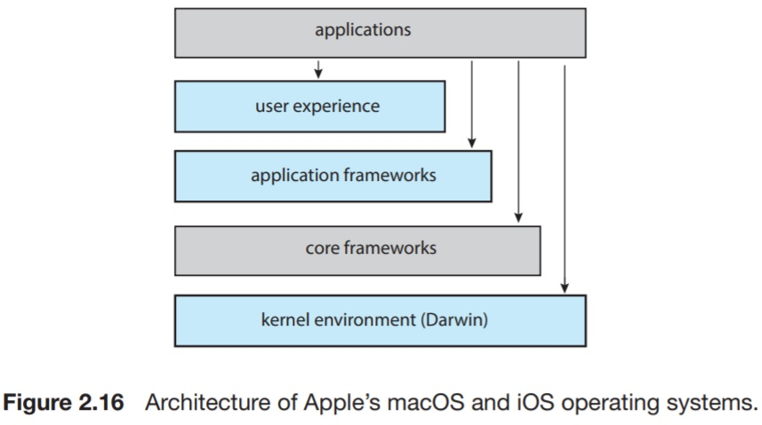
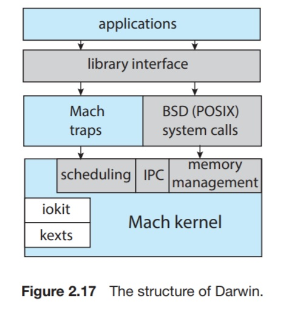
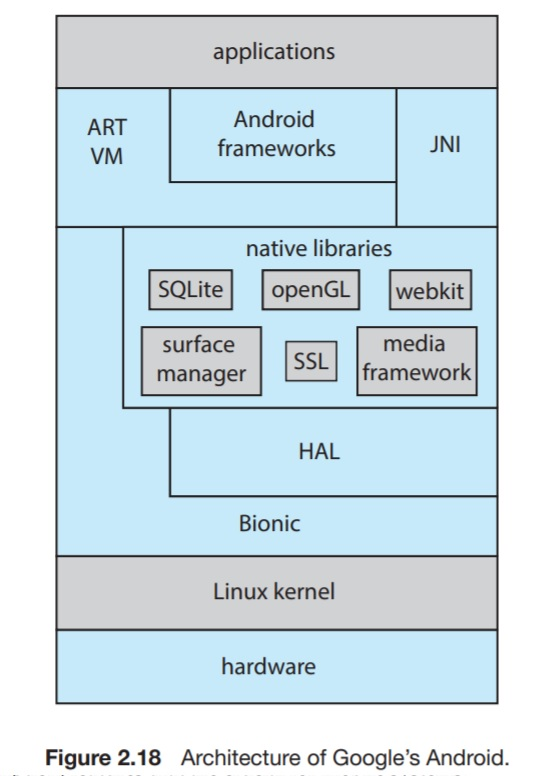

# 2.8.5 Hybrid Systems

All commercial OSs do not adhere strictly to one design structure. Instead, they combine different structures aiming for systems that address performance, security, reliability, and usability.  
Linux is monolithic because its kernel runs in a single address space. However, it is also modular because of the dynamically-added functionalities to the kernel.  
Windows is largely monolithic. However, it retains some behavior of microkernels and dynamically loadable modules.

## 2.8.5.1 macOS and iOS

Apple's macOS is designed to run on desktop and laptop computer systems, whereas iOS is a mobile operating system.  
Architecturally, both have much in common.  

* User experience layer. Defines the software interface that allows users to interact with the computing devices. (Aqua for macOS and Springboard for iOS)

* Application frameworks layer. Provides an API for Objective-C and Swift programming languages.
Cocoa and Cocoa Touch for macOS and iOS respectively.
Cocoa Touch is used by iOS to provide support for hardware features unique to mobile devices, such as touch screens.

* Core frameworks. Defines frameworks that support graphics and media, including Quicktime and OpenGL.

* Kernel environment. _Darwin_. Includes the Mach microkernel and BSD UNIX kernel.

Applications can deal with all the layers provided. An example of an application interacting with the kernel environment is a C program that makes POSIX system calls.

Significant distinctions between macOS and iOS:

* macOS is compiled for Intel architectures because it's intended to run on desktop and laptop computers. iOS is compiled to run on ARM-based architectures (the most prevalent ISA for processors running mobile devices). The iOS kernel has been optimized for better power management and aggressive memory management.
* iOS is much more restricted than macOS. iOS does not allow access to POSIX and BSD APIs, whereas they're available to macOS developers.

Darwin consists of two kernels. The Mach microkernel and the BSD UNIX kernel. Subsequently, it provides two system-call interfaces.
The Mach system calls (known as traps) and BSD system calls (POSIX). Those interfaces provide libraries for networking, security (just to name a few).  
Mach provides fundamental OS services, including memory management, CPU scheduling, and IPC facilities such as message-passing and remote procedure calls (RPCs)

> RPC: invoking a procedure in a different address space.

Because Mach is a microkernel, much of the functionality it provides is available through _kernel abstractions_.
Kernel abstractions include _task_&#8203;s, threads, memory objects, and ports (used for IPC).

An example of how the two kernels work together: An application might call the BSD POSIX `fork()` system call. Mach will use a _task_ kernel abstraction to represent the newly-created process.

> A task is a process in the Mach nomenclature.

The kernel environment provides an _I/O kit_. This is used for the development of device drivers and dynamically loadable modules.  

Mach, despite structured as a microkernel through kernel abstractions, does not run those subsystems in userspace in their own address spaces. Instead, it combines Mach, BSD, the I/O kit, and ant kernel extension into a single address space.  
Message-passing still occurs between the subsystems, but its more efficient because all subsystems share the same address space, so no copying is required (it hence retains most of the monolithic kernel performance).

## 2.8.5.2 Android

Android is a layered stack of software that provides a rich set of frameworks supporting graphics, audio, and hardware interfacing features.  
These frameworks provide services for developing applications that run on a multitude of Android-enabled devices.  
Software applications are developed in the Java language, but they usually do not use the standard Java API.  
Google has designed an Android API for Java development. Android applications are compiled into a form that can run in the Android RunTime (ART), which is a virtual machine designed for Android and is optimized for mobile devices.  
Java apps are compiled into `.class` bytecode, and then translated into `.dex` executable files.  
ART performs _ahead-of-time_ (AOT) compilation, in which the `.dex` files are compiled into native machine code when they are installed on a device, from which they can execute on the ART.

> The case with other VMs: applications are translated to native instructions while they're executed.

AOT compilation allows more efficient application execution as well as reduced power consumption (those are crucial features for mobile systems).  

Android application developers can use the Java Native Interface (JNI) to bypass the virtual machine and directly access the hardware. (clearly not portable from a device to another).

Google abstracts the hardware using a hardware abstraction layer, or HAL to provide uniform interfaces for hardware components such as the camera, GPS chip, and other sensors.

Google designed a lightweight, low-power standard C library instead of `glibc`.

Google modified the Linux kernel greatly to support needs for mobile devices such as power management. It also added a new means of IPC known as Binder.