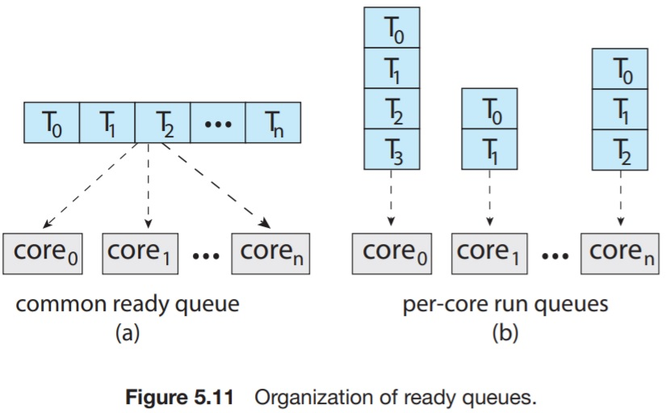
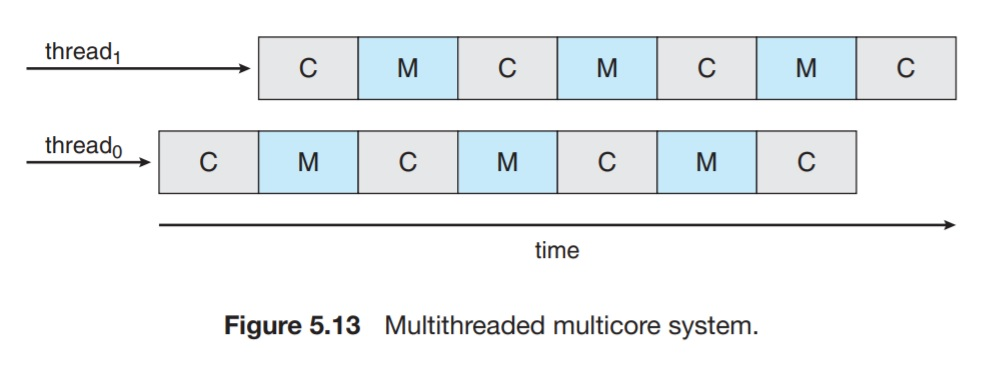

# 5.5 Multi-processor Scheduling

Asymmetric multiprocessing:

* Only one CPU handles the scheduling, I/O processing, and other system activities.
* Simple design, only one CPU accesses system data structures.
* Reduces the need for data sharing
* This master processor might become the system bottleneck as of the amount of processing it has to do.

Symmetric Multiprocessing:

* Each processor is self-scheduling.
* The scheduler examines the ready queue of all the processors and select the threads to run.
  * All threads may be in the same ready queue.
  * Each processor may have its own private ready queue.

Considering the first technique, as each processor is responsible for its scheduling, a race condition might occur.

Locking is used to protect the common ready queue from this race condition. Locking would be highly contended because all processors may need to get a newly-scheduled thread simultaneously. This would become the system's bottleneck.

The second approach does not suffer from this problem and hence it's the most adopted scheme in modern systems supporting SMP.

Using private, per-processor queues may lead to more efficient use of cache memory.

An issue of multiple queues is unbalanced workloads. Balancing algorithms can be used to equalize workloads among all processors.

All modern systems support SMP, including Windows, Linux, macOS, Android, and iOS.

## 5.5.2 Multicore Processors

Accessing memory can cause a processor to await the data delivery for a long time. This is because of the gap between the speed on which CPUs operate and that on which memory operates. _Memory stalls_ can cause a CPU to spend more than 50% of its time waiting for  data.

Modern CPUs provide multiple _hardware-managed threads_. That way, if a thread stalls for any reason, the core can switch to another thread.

This is known as _chip multithreading_, _hyper-threading_, or _simultaneous multithreading_.

There are two ways to multithread a processing core.

* Coarse-grained multithreading: A thread executes on a core until a long-latency event occurs. On the event occurrence, the processor switches to another thread. (Instruction pipeline must be flushed before the other thread can begin execution on a processor core)
* Fine-grained multithreading: Switching occurs on a much finer level of granularity. (One instruction per thread).  

Hardware-managed threads share processor resources such as pipeline and cache. Hence, they cannot run parallely and the OS must schedule kernel-level threads onto hardware threads.

One approach is to use round-robin algorithm to multiplex between hardware threads.  

The two decisions may be done on the same level of abstraction. If the OS thread scheduling is aware of hardware threads, it can make more educated decisions.

Example: A system with two cores, each core have two hadrware-managed threads. The OS can schedule two programs onto the same core (be multiplexed onto the hardware threads[bad]). Or it can schedule them into separate processors and hence run parallely.

## 5.5.3 Load Balancing

To fully leverage the SMP system, it is important to keep the workload balanced among all cores. Load balancing attempts to keep the workload equidistributed among all the available cores.

> Load balancing is only necessary on a system that uses multiple wait per-processor queues. On which systems, threads may or may not be scheduled onto one core's ready queue (and hence have no pending work). On a system that leverages a single queue, an idle processor will just be scheduled to a runnable thread from the ready queue.

There are two techniques used to achieve load balancing: `push migration` and `pull migration`.  

* Push migration: A specific task periodically checks the load on each processor. On finding an imbalance, it evenly distributes the load by _pushing_ threads from the overloaded to idle or less-busy processors.
* Pull migration: An idle processor pulls a waiting task from a busy processor.

Those two techniques are not mutually execlusive.

## 5.5.4 Processor Affinity

A thread, if run on the same processor, can leverage the cache memories much better than if run on multiple processors (low-level caches are shared).  
**Processor affinity** can be set for a thread so that it is always sheduled on the same processor.  
It comes freely with multiple per-processor wait queues (A thread will always be put in the ready queue of a specific processor).  

**Soft affinity**: The OS does _not_ guarantee that a particular process will be scheduled on a specific processor (due to load-balancing, for example).  
**Hard affinity**:  Some OSs provide system calls that confine a process to one processor or a set of them.

If a system is organized as _NUMA_, scheduling can also provide bad performance if a thread is scheduled into a core of which data is not relevant to the thread. Thus, the thread needs to access data from other cores' private memory. Despite feasible, it is slow. By having a NUMA-aware scheduler and memory-placement algorithms, a thread may be always scheduled onto the processor that have relevant data in its private memory.

Load-balancing often counteracts the benefits of processor affinity.  
Load-balancing might shuffle threads around the systems to ensure balance, thus putting a thread onto a core that have cached data related to some other thread.

## 5.5.5 Heterogeneous Multiprocessing

Processors vary in their clock speed and power management policies. Yet all of them run the same ISA and are considered separate processors (symmetric MP).  
This approach enables better power management by having slow but low-power processors to run the long-turn background processes and hence consume less energy. Similarly, short tasks that require more processing power can be allocated to high-performance processors.  
Also, it enables having a _power saving mode_. It can be achieved by solely rely on the low-power processors and halt high-performance processors.
