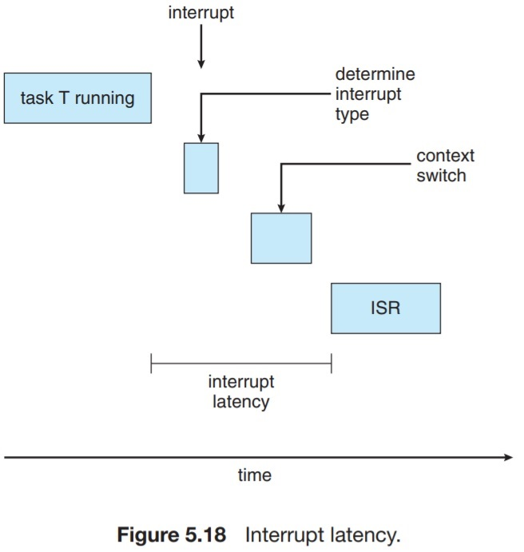
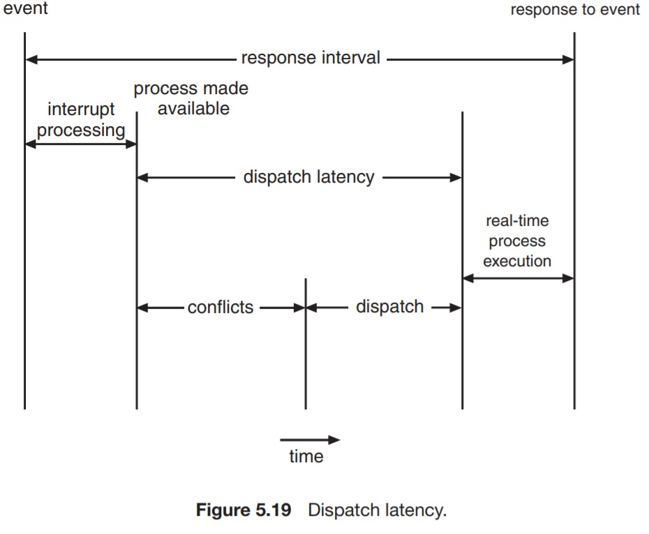

# Real-time CPU Scheduling

Real-time systems are categorized as either _soft real-time systems_, or _hard real-time systems_.

* **Soft real-time systems**: Provide no guarantee as to when a critical task will be scheduled. They guarantee that critical (real-time) processes will be prefered over those which are less time critical.
* **Hard real-time systesm**: Provides guarantees that real-time processes will be serviced by its deadline. _service after deadline is the same as no service at all._

## 5.6.1 Minimizing Latency

> **Event Latency** is the amount of time that elapses from when an even occurs to when it is serviced.

There are two types of latencies that affect the performance of real-time systems. _interruput latency_ and _dispatch latency_.

> **Interrupt Latency**: The period of time from the arrival of an interrupt to the start of the ISR.

When an interrput occurs, the OS must first let the CPU finish its current instruction. Afterwards, it has to determine the type of interrupt that occurred, save the processor state, and then jump to the corresponding ISR.

The total time required to perform those tasks is the interrupt latency.

It's crucial for RTOS to minimize the interrupt latency in order to serve real-time tasks in time.

> **Dispatch Latency** is the amount of time required for the scheduling dispatcher to stop one process and start another.

Conflict phase of the dispatch latency has two components.

1. Preemption of any process running in the kernel.
2. Release by low-priority processes of resources needed by a high-priority process.

## 5.6.2 Priority-Based Scheduling

Real-time OS schedulers must support preemptive, priority-based scheduling. That is, if a real-time, high priority task arrives, the OS has to preempt the low-priority task and give control to the high-priority task.

Preemptive, priority-based scheduling algorithms only provide _soft real-time_ guarantees, that is, giving preference to real-time tasks over those of less time criticality.

The simplest form of real-time tasks are the processes considered periodic. That is, they require the CPU at constant intervals. Once a periodic request has acquired the CPU, it has a fixed processing time `t`, and a deadline `d` by which it must be served, and a period `p`. The relationship between the three parameters is: `0 <= t <= d <= p`. The rate of a periodic task is 1/p.

A task has to announce its deadline requirement to the scheduler. The scheduler must employ a sort of _admission-control_ algorithm, which decided whether the request can be served within its deadline requirement or not.

## 5.6.3 Rate-Monotonic Scheduling

The rate-monotonic algorithm schedules periodic tasks using a static priority policy with preemption.

Each task is assigned a priority that is inversily proportional to the period.

This makes the system assign a high priority to processes that are more frequent.

This algorithm assumes that burst times are the same for one task.

The deadline of a task may be that it must complete before its period ends.

> Rate-monotonic scheduling is considered optimal in that if a set of processes cannot be scheuled by this algorithm, it cannot be scheduled by any other algorithm that assigns static priorities.

> CPU utilization is bounded, with N processes, maximum utilization is N*(2^(1/N) - 1).

## 5.6.4 Earliest-Deadline-First

EDF scheduling assigns priorities _dynamically_ according to deadline. The earlier the deadline, the higher the prioriry.

With EDF, a prcoess must announce its deadline on being runnable.

Priorities may have to be adjusted according to the newly-admtted process' deadline.

Unlike rate-monotonic scheduling, EDF does not require the processes to be periodic. The only requirement is that a process announces its deadline upon admittance.

In theory, CPU utilization can be 100% by using EDF, but practically it's never feasible due to the cost of context switching between processes and interrupt handling.
