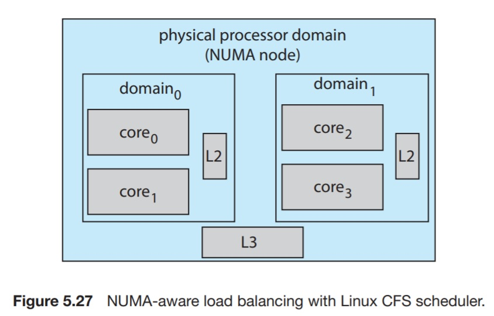

# 5.7.1 Linux Scheduling

In Linux 2.6.23, the Completely Fair Scheduler(CFS) became the default Linux scheduling algorithm.

Scheduling in Linux is based on _scheduling classes_. By using different classes, the kernel can accomodate different scheduling algorithms based on the need of the system and the processes. There are two default classes shipped with Linux kernels, those are the `default scheduling using the CFS` and `real-time scheduling`. 

The CFS scheduler assigns a proportion of CPU processign time to each task. This proportion is calculated based on the _nice value_ assigned to each task. Nice values range from -20 to +19.
Numerically-high nice values indicate lower relative priority.
(When a process is _highly_ nice, it leaves room to other processes to finish first).

CFS uses _targeted latency_, which is an interval of time during which every runnable task should run at least once.

Proportions of the CPU time are allocated from the value of the targeted latency.

Targeted latency can increase dynamically if the number of active tasks in the system grow beyond a certain threshold.

The CFS records how long each task has run by maintaining the virtual run time of each task in the PCB, using the per-task variable `vruntime`. The increase in `vruntime` is proportional to the nice value. 

* A process of default priority (nice value = 0), if run for 200 ms, then its virutal run time will also be 200 ms.
* A process of high priority (negative nice value), if run for 200 ms, its virtual run time will be lower than 200ms.
* A process of low priority (positive nice value), if run for 200 ms, its virtual run time will be greater than 200ms.

To  decide which process to run next, the CFS simply selects the task that has the lowest `vruntime`. 

CFS is a preemptive scheduler, thus a high-priority task can preempt a lower-priority task.

Linux supports the POSIX real-time task scheduling, implementing both `SCHED_FIFO` and `SCHED_RR`. 

Real time tasks are assigned the priorities from 0 to 99. Normal (non-real-time) tasks are assigned the priorities from 100 to 139 based on the nice value.

The CFS supports laod balancing using a sophisticated technique that equalizes the load among processing cores.

This technique is NUMA-aware and minimizes the migration of threads.

CFS defines the load of each thread is a combination of its priority and its CPU utilization. A thread of low load may be of high priority and I/O bounded (hence no great CPU utilization) or low priority and CPU bounded.

The load of a queue is the sum of its threads' load. Thus balancing the load means roughly equalizing the load in all the queues.

Migrating a thread from one processor to another will invalidate its cached data. Furthermore, in NUMA systems, it can lead to high memory access time.

Linux identifies a hierarchical system of scheduling domains. A scheduling domain is a set of processors that a thread can be scheduled in each with no great loss.

