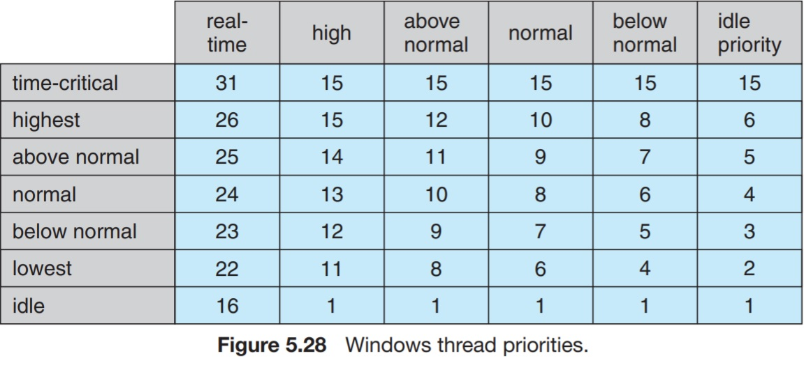

# 5.7.2 Windows Scheduling

Windows uses a priority-based, preemptive scheduling algorithm. The Windows scheduler always ensures that the thread of highest priority is will always run.

The portion of Windows' kernel that is responsible for scheduling threas is called the dispatcher.

A thread selected to run by the dispatcher will continue running until it gets preempted by a higher-priotiy thread, until it terminates, until its time quantum ends, or until it calls a blocking system call.

It supports real-time threads, giving them the highest priority. A real-time thread will always preempt a lower-priority thread when it becomes _runnable_.

Windows uses 32-level priority scheme.

Real-time priority class contains threads with priority from 16 to 31.

Variable class contains threads with priorities ranging from 1 to 15.

A thread of priority 0 is used for memory management.

The dispatcher uses a queue for each priority class and traverses the queues from the highest priority to the lowest priority until it finds a runnable thread.

If no threads found, the dispatcher will schedule a special thread called the _idle thread_.

The Windows API identifies the following six priory classes to which a process can belong:

* IDLE_PRIORITY_CLASS
* BELOW_NORMAL_PRIORITY_CLASS
* NORMAL_PRIORITY_CLASS
* ABOVE_NORMAL_PRIORITY_CLASS
* HIGH_PRIORITY_CLASS
* REALTIME_PRIORITY_CLASS

Process are typically members of the NORMAL_PRIORITY_CLASS by default. A parent process can define the priority of its child process.

If the parent process was a member of the IDLE_PRIORITY_CLASS, the child process will also be a member of the same class.

The priority of a process by the `SetPriorityClass()` function in the Windows API.

Priorities in all classes expect the REALTIME_PRIORITY_CLASS are variable, meaning that the priority of a thread belonging to one of these classes can change.

Each priority class ccontains six relative priority classes.

* IDLE
* LOWEST
* BELOW_NORMAL
* NORMAL
* ABOVE_NORMAL
* HIGHEST
* TIME_CRITICAL

The ultimate priority of a thread is based on both the priority class it belongs to and its relative priority within that class.

The initial priority of a thread is typically the base priority of the process that thread belongs to.

The `SetThreadPriority()` function can alter the priority of a thread.

When the time slice of a thread finishes, the thread is interrupted. If the thread is a variable-priority class member, its priority is lowered.

Lowering the priority tends to limit the CPU consuption of compute-bound threads.

When a variable-priority thread is released from a wait operation (a fetch from keyboard for example), the dispatcher boosts its priority.

This strategy tends to give highly-interactive processes good response times.

Windows boosts the priority of the process which the user is currently interacting with to enhance its response time.

When a user is running an interactive program, the stsrem needs to provide especially good performance. With that being said, Windows has a special scheduling rule for NORMAL_PRIORITY_CLASS.

Windows distinguishes between the _foreground process_ that is currently selected on the screen and the _background processes_ that are not currently selected.

When a process is moved to the foreground, Windows increases its time quantum by some factor, typically by 3.

___

Windows also supports scheduling on multiprocessor systems. It attempts to schedule a thread on the most optimal core for that thread.

Windows maintains the most affinitive processing core for each thread. It also groups available cores into logical groups. Hardware threads of the same core belong to the group to which the core belongs.

Windows tries to always schedule threads into their most affinitive logical group.
